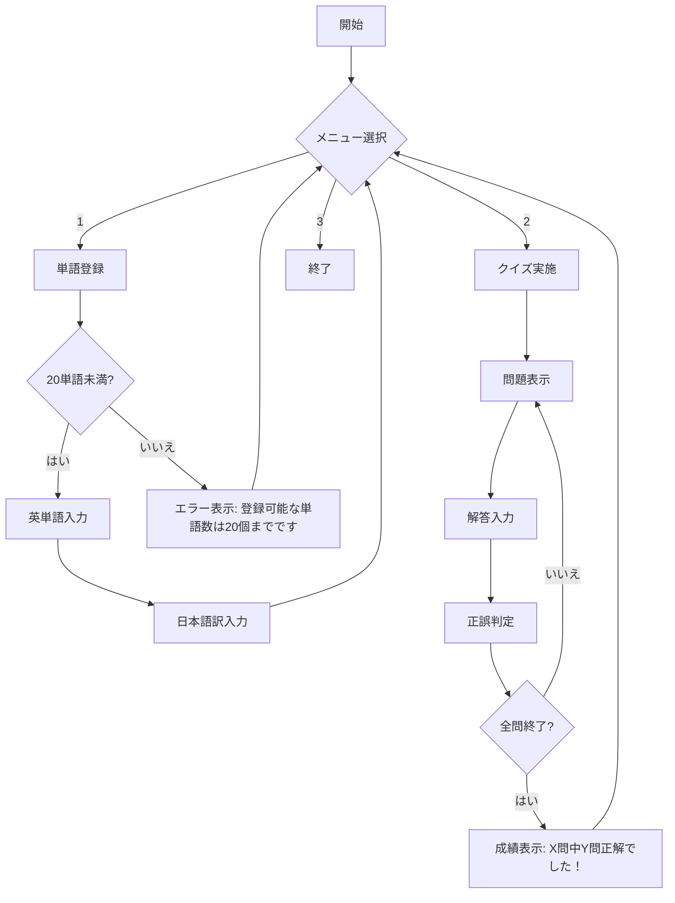

# 要件定義書

## 1. システム概要

このプログラムは英単語を勉強する時に使います。
英単語と日本語訳を登録して、クイズができます。

## 2. 機能要件

### 必須機能

- 英単語の登録ができます（最大20個まで）。
- 日本語訳の登録ができます。
- 単語クイズができます。
- 正解数を数えられます。

### 画面の機能

- メニュー表示があります。
- 単語登録画面があります。
- クイズ画面があります。

### 入力規則

- 英単語は半角で入力されることを前提とします（入力チェック機能は実装しません）。
- 日本語訳は全角で入力されることを前提とします（入力チェック機能は実装しません）。

## 画面遷移図（表示）

## エラーメッセージ仕様

### 単語登録時のエラー
- 20個を超える登録試行時: 「登録可能な単語数は20個までです」

### クイズ実行時のエラー
- 単語が未登録時: 「単語が登録されていません」

### メニュー選択時のエラー
- 無効な選択時: 「1-3の数字を入力してください」

## 成績表示仕様

クイズ終了時に以下の形式で表示します：
- 表示形式: 「X問中Y問正解でした！」
- 例: 「3問中2問正解でした！」
